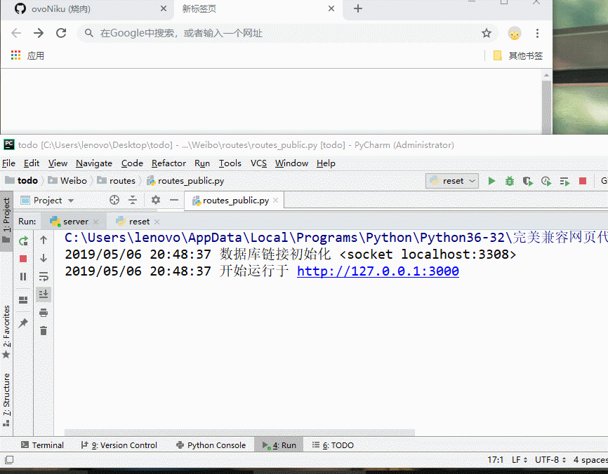
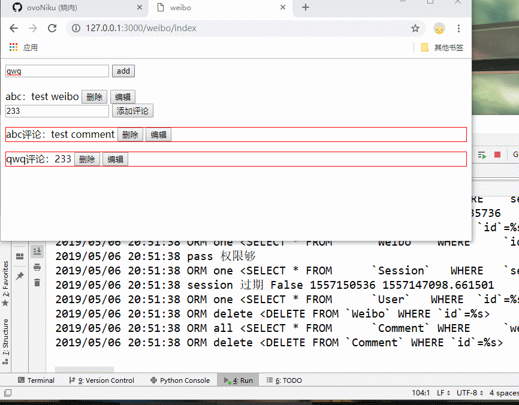
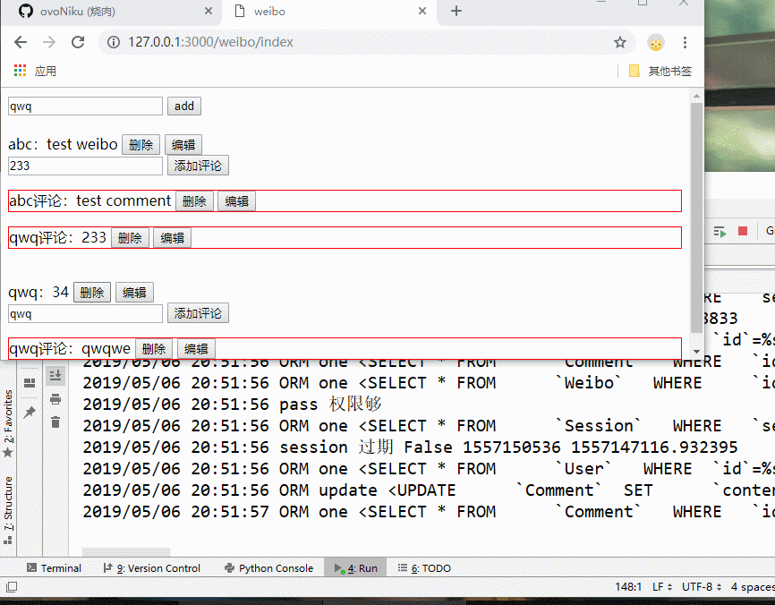

# Weibo

### **注册/登录**

1. 注册成功后自动跳转到登录页面
2. 登陆成功后自动跳转到主页

### **发微博/评论**

1. 登录用户可增删改

### **数据权限**

1. 所有路由都要求登录才能访问
1. 所有 weibo 修改都只能本人才能修改
1. 所有 comment 修改都只能本人或者该 comment 对应 weibo 的 user。
2. 权限不足的时候有 alert 弹窗提醒
